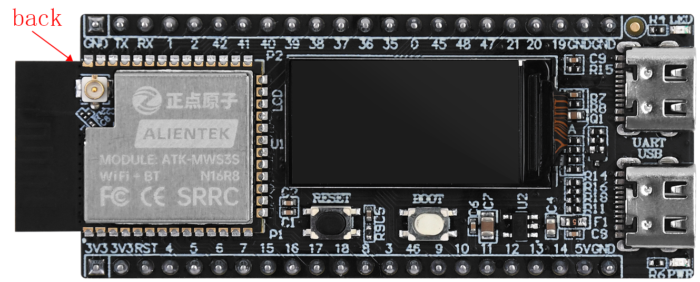

## sd example

### 1 Brief

The main function of this code is to learn the TF card module.

### 2 Hardware Hookup

The hardware resources used in this experiment are:

- LED - IO1
- UART0
  - TXD0 - IO43
  - RXD0 - IO44
- SPI_LCD
  - CS - IO21
  - SCK - IO12
  - SDA - IO11
  - DC - IO40
  - PWR - IO41
  - RST - IO38
- SD
  - SDCS - IO2
  - SCK - IO12
  - MOSI - IO11
  - MISO - IO13

The position of the sdcard in the development board is shown as follows:

### 3 Running

#### 3.1 Compilation and Download

There are two ways to download code for ESP32S3.

##### 3.1.1 USB UART

.png)

**1 Compilation process**

- Connect the USB UART on the DNESP32S3M mini board to your computer using a USB data cable
- Open the '11_sd' example using VS Code
- Select UART port number (Figure â‘?:ESP-IDF: Select Port to Use (COM, tty, usbserial))
- Set Engineering Target Chip (Figure â‘?:ESP-IDF: Set Espressif Device Target)
- Clearing project engineering(Figure â‘?:ESP IDF: Full Clean)
- Select Flash Method (Figure â‘?:ESP-IDF: Select Flash Method)
- Build Project (Figure â‘?:ESP-IDF: Build Project)

**2 Download process**

- Download(Figure â‘?:ESP-IDF: Flash Device)

##### 3.1.2 JTAG(USB)

.png)

**1 Compilation process**

- Connect the USB(JTAG) on the DNESP32S3M mini board to your computer using a USB data cable
- Open the '11_sd' example using VS Code
- Select JTAG port number(Figure â‘?:ESP-IDF: Select Port to Use (COM, tty, usbserial))
- Clearing project engineering(Figure â‘?:ESP IDF: Full Clean)
- Select Flash Method(Figure â‘?:ESP-IDF: Select Flash Method)
- Build Project(Figure â‘?:ESP-IDF: Build Project)

**2 Download process**

- Download(Figure â‘?:ESP-IDF: Flash Device)

#### 3.2 Phenomenon

After normal operation, the LCD displays the information (capacity) of the SD card. 

