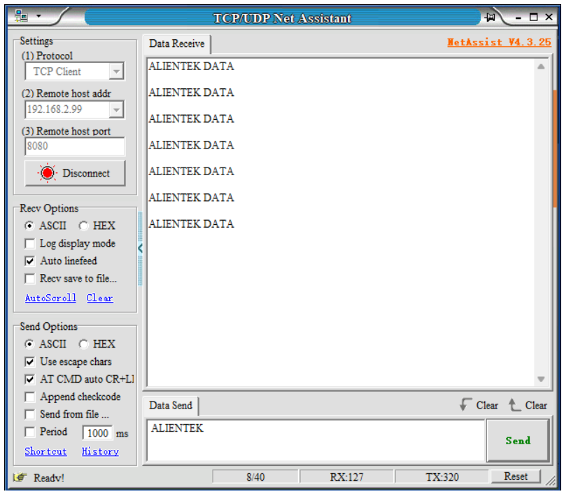

## wifi tcpclient example

### 1 Brief

Learn about the TCPServer protocol.

### 2 Hardware Hookup

The hardware resources used in this experiment are:

- LED - IO1

- LCD - 0.96 inch screen
  - CS - IO21
  - SCK - IO12
  - SDA - IO11
  - DC - IO40
  - PWR - IO41
  - RST - IO38

The WiFi is an internal peripheral, so there is no corresponding connection schematic diagram.

### 3 Running

#### 3.1 Compilation and Download

There are two ways to download code for ESP32S3.

##### 3.1.1 USB UART

.png)

**1 Compilation process**

- Connect the USB UART on the DNESP32S3 development board to your computer using a USB data cable
- Open the '07_WiFi_TCPServer' example using VS Code
- Select UART port number (Figure â‘?:ESP-IDF: Select Port to Use (COM, tty, usbserial))
- Set Engineering Target Chip (Figure â‘?:ESP-IDF: Set Espressif Device Target)
- Clearing project engineering（Figure �:ESP IDF: Full Clean�
- Select Flash Method (Figure â‘?:ESP-IDF: Select Flash Method)
- Build Project (Figure â‘?:ESP-IDF: Build Project)

**2 Download process**

- Download（Figure �:ESP-IDF: Flash Device�

##### 3.1.2 JTAG(USB)

.png)

**1 Compilation process**

- Connect the USB(JTAG) on the DNESP32S3 development board to your computer using a USB data cable
- Open the '07_WiFi_TCPServer' example using VS Code
- Select JTAG port number (Figure â‘?:ESP-IDF: Select Port to Use (COM, tty, usbserial))
- Clearing project engineering（Figure �:ESP IDF: Full Clean�
- Select Flash Method (Figure â‘?:ESP-IDF: Select Flash Method)
- Build Project (Figure â‘?:ESP-IDF: Build Project)

**2 Download process**

- Download（Figure �:ESP-IDF: Flash Device�

#### 3.2 Phenomenon

Open the network debugging assistant, configure the connection protocol and network parameters. Once the network connection is successful, data transmission and reception can be achieved.

Note: Before connecting, the computer and the development board must be connected to the same WiFi hotspot.

1.First, open the `wifi_config.c` file in the project and configure the macros `DEFAULT_SSID` and `DEFAULT_PWD`. Among them, DEFAULT_SSID represents the account name required to connect to WiFi, while DEFAULT_PWD represents the password for that WiFi.

2.Download the code to the DNESP32S3M mini board.

4.Open the network debugging assistant, configure the connection protocol and network parameters. 

5.Open ESP-IDF monitor on Device to view received data.