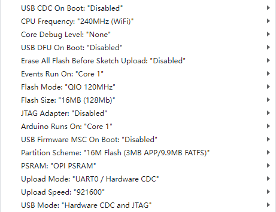

## led example

### 1 Brief

The main function of this code is to let the onboard LED blink alternately at a frequency of 500 milliseconds.

### 2 Hardware Hookup

The hardware resources used in this experiment are:

- LED - IO1

The position of the LED in the mini board is shown as follows:

### 3 Running

#### 3.1 Compile & Download

**1 Compilation process**

- Connect the UART interface in the upper left corner of the image to the computer using a USB cable
- 01_led routine opened using Arduino IDE2
- Select Target Board (① Arduino IDE: Tools --> Board --> esp32 --> ESP32S3 Dev Module)
- Select UART port number (② Arduino IDE: Tools --> port --> COMx)
- Set ESP32S3 parameter (③ Arduino IDE: Tools --> esp32s3 parameter)

- Compile arduino project (④ Arduino IDE: "Sketch --> Verify/Compile" or "Ctrl+R" or "Verify button")
- Wait for compilation success (⑤ Arduino IDE: Output Window --> show "Done compiling")

**2 Download process**

- Download (⑥ Arduino IDE: "Sketch --> Upload" or "Ctrl+U" or "Upload button")

#### 3.2 Phenomenon

After normal operation, the red LED will blink periodically.
