## spi_lcd example

Note: spi_lcd example need to install "TFT_eSPI" LIBRARY.

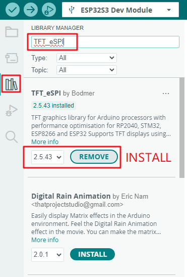

We need to modify the User_Setup.h file of TFT_eSPI library to adapt to the 0.96 inch screen.

1. Set the screen driver (comment out the default driver, uncomment the ST7735 driver)

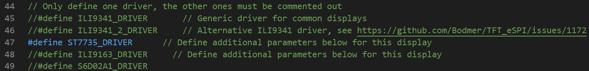

2. Color sequence modification (need to see whether there is a problem with the color displayed by the LCD screen driver)

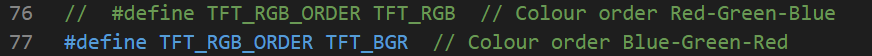

3. LCD screen resolution (note out the appropriate, 0.96 inch LCD resolution is 160*80)

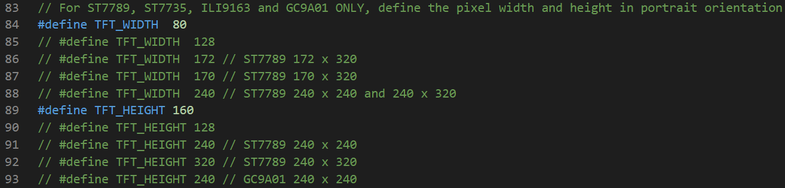

4. Set the body and reverse color of ST7735 (ST7735 unique configuration options, display exceptions such as color reverse color, image mirroring, etc., can be unannotated and compiled to view)

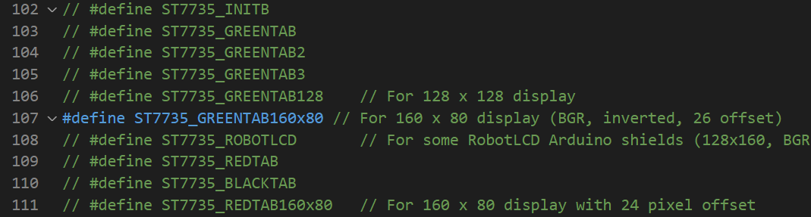

5. Color reversal (color reversal must be used)

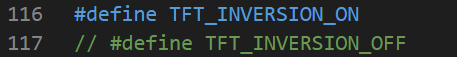

6. Configure the backlight control pin (this configuration takes effect only)

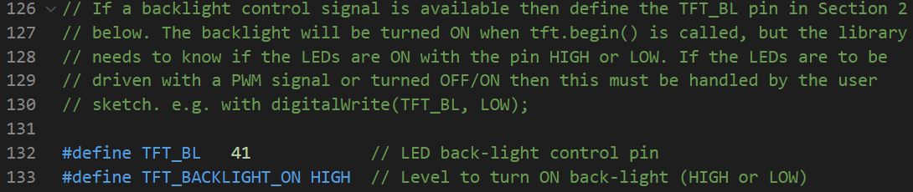

7. Set the LCD screen related pins (comment out the default pin definition)

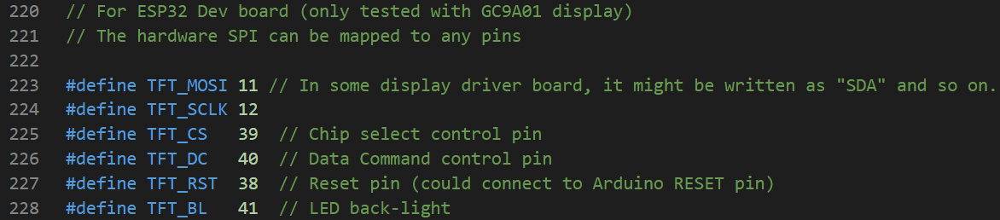

8. Use HSPI driver (The default is VSPI, choose HSPI here)

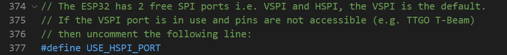

### 1 Brief

The main function of this code is to use a 0.96 inch screen to display experimental information.

### 2 Hardware Hookup

The hardware resources used in this experiment are:

- LED - IO1
- UART0
	- TXD0 - IO43
	- RXD0 - IO44
- SPI_LCD
	- CS - IO39
	- SCK - IO12
	- SDA - IO11
	- DC - IO40
	- BL - IO41
	- RST - IO38

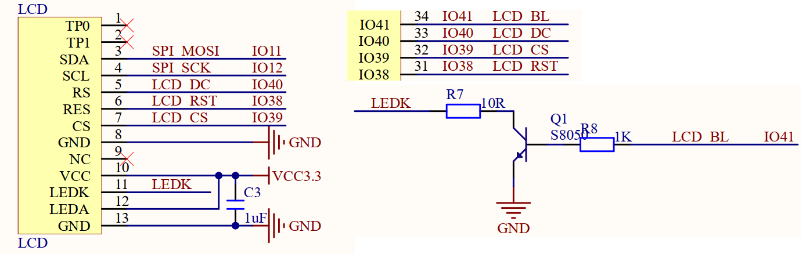

The place position of the SPILCD in the mini board is shown as follows:

### 3 Running

#### 3.1 Compile & Download

**1 Compilation process**

- Connect the UART interface in the upper left corner of the image to the computer using a USB cable
- 07_spi_lcd routine opened using Arduino IDE2
- Select Target Board (① Arduino IDE: Tools --> Board --> esp32 --> ESP32S3 Dev Module)
- Select UART port number (② Arduino IDE: Tools --> port --> COMx)
- Set ESP32S3 parameter (③ Arduino IDE: Tools --> esp32s3 parameter(please see led example))
- Compile arduino project (④ Arduino IDE: "Sketch --> Verify/Compile" or "Ctrl+R" or "Verify button")
- Wait for compilation success (⑤ Arduino IDE: Output Window --> show "Done compiling")

**2 Download process**

- Download (⑥ Arduino IDE: "Sketch --> Upload" or "Ctrl+U" or "Upload button")

#### 3.2 Phenomenon

After normal operation, the spilcd will display experimental demo.

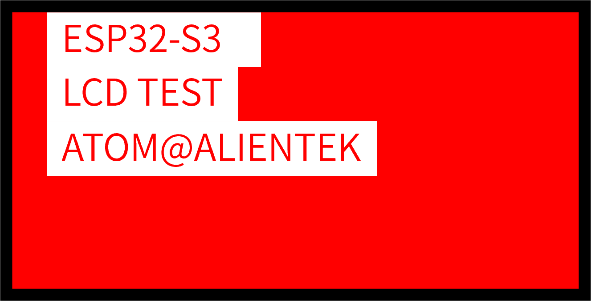