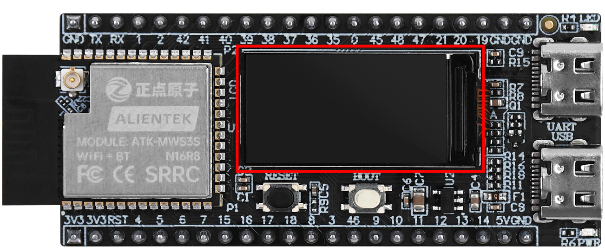

## spi_lcd example

### 1 Brief

The main function of this code is to use a 0.96 inch screen to display experimental information.

### 2 Hardware Hookup

The hardware resources used in this experiment are:

- UART0
  - TXD0 - IO43
  - RXD0 - IO44
- SPI_LCD
  - CS - IO21
  - SCK - IO12
  - SDA - IO11
  - DC - IO40
  - PWR - IO41
  - RST - IO38

The position of the SPILCD in the development board is shown as follows:

### 3 Running

#### 3.1 Download

If you need to download the code, please refer to the 3.3 Running Offline section in the [Developing With MicroPython tutorial](../../../../1_docs/Developing_With_MicroPython.md), which provides a detailed download process.

#### 3.2 Phenomenon

spilcd displays refreshed color.
