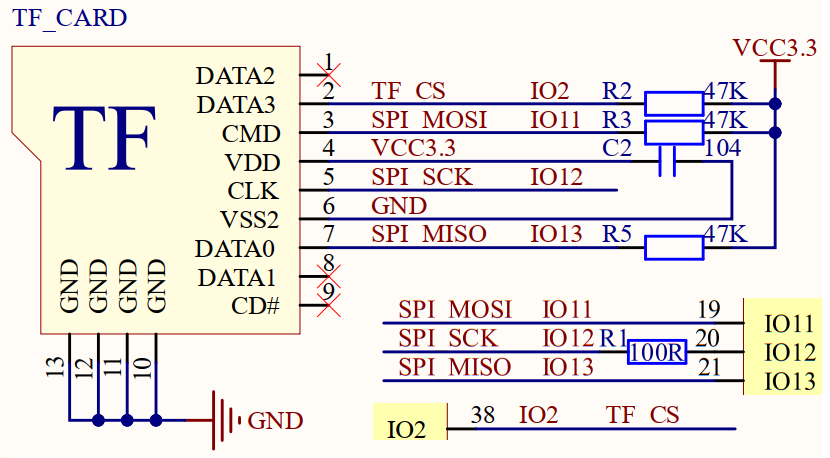
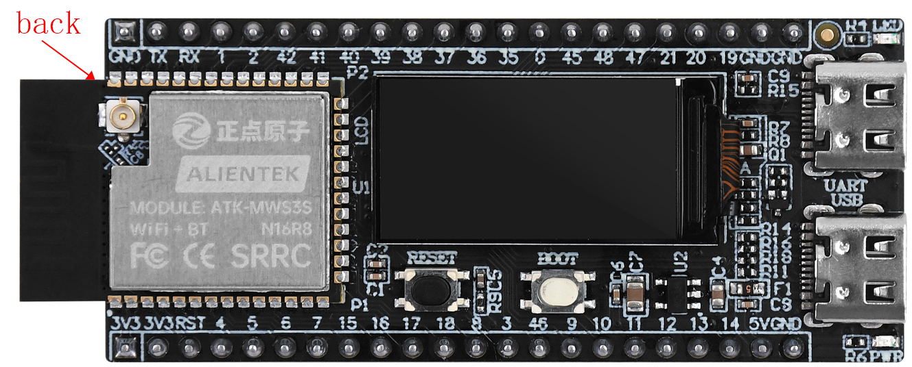

## sdcard example

### 1 Brief

The main function of this code is to learn the TF card module.

### 2 Hardware Hookup

The hardware resources used in this experiment are:

- LED - IO1
- UART0
  - TXD0 - IO43
  - RXD0 - IO44
- SPILCD
- SD
  - SDCS - IO2
  - SCK - IO12
  - MOSI - IO11
  - MISO - IO13

The position of the sdcard in the development board is shown as follows:

### 3 Running

#### 3.1 Download

If you need to download the code, please refer to the 3.3 Running Offline section in the [Developing With MicroPython tutorial](../../../../1_docs/Developing_With_MicroPython.md), which provides a detailed download process.

#### 3.2 Phenomenon

Perform read and write operations on files in the SD card, then display the read content on SPI LCD.
