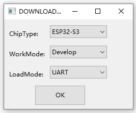
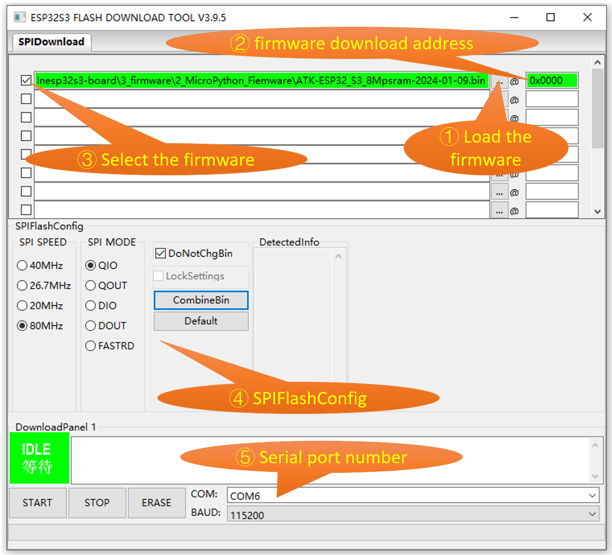
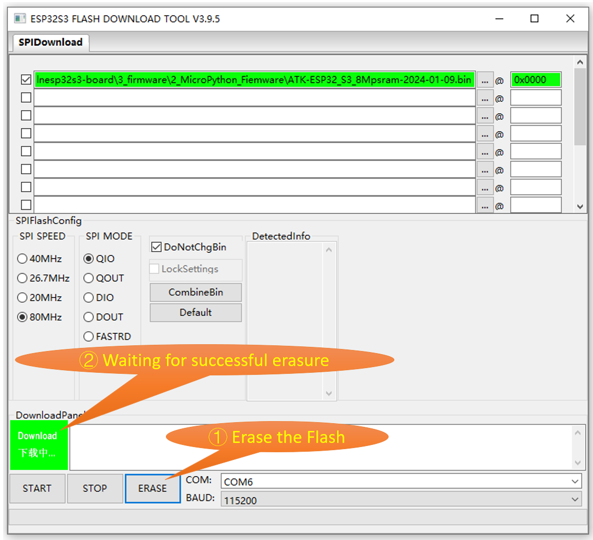
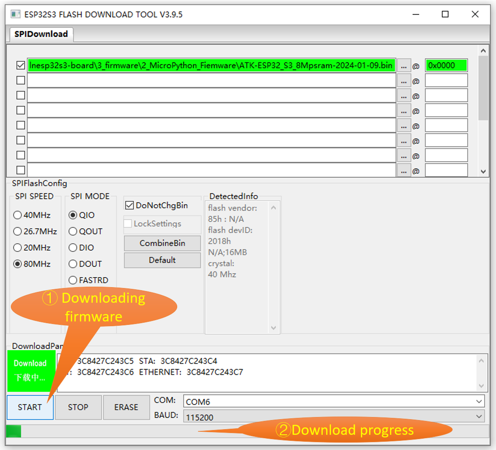

# Firmware Repository

This repository contains two folders: `1_ESP_IDF_Firmware` and `2_MicroPython_Firmware`.

## 1_MicroPython_Firmware

The 1_MicroPython_Firmware folder contains two MicroPython firmware provided by ALIENTEK company. The ATK-ESP32_S3_8Mpsram(with_AI)-2024-01-09.bin firmware includes AI interfaces, while the ATK-ESP32_S3_8Mpsram-2024-01-09.bin firmware does not include AI interfaces.

---

## Firmware Download

1.Open the "./4_tools/flash_download_tool_3.9.6_0" folder, and double-click on "flash_download_tool_3.9.5.exe" to launch the ESP32S3 Flash Download Tool.

2.Select the chip type, operating mode, and download method.

3.Load the downloaded firmware.

4.Select the serial port number (COM) and download baud rate.

5.Press the "ERASE" button to erase the Flash.

6.Press the "START" button to download the firmware to the ESP32S3 module.

