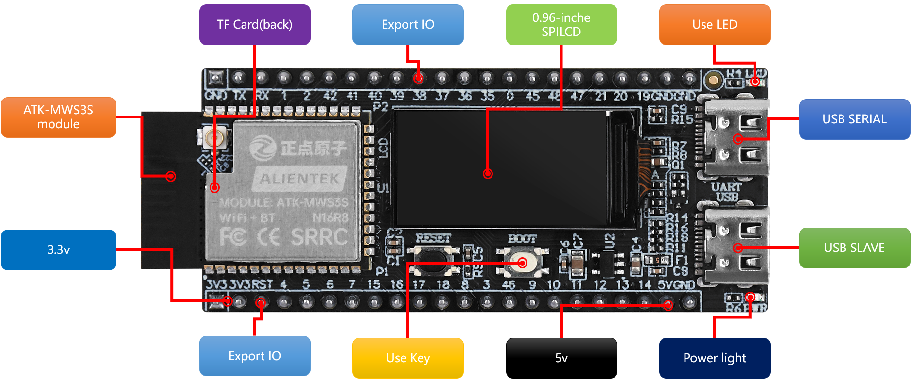

# 1 Framework

The file framework of the data disk is as follows:

| Root  directory | Description                                                  |
| --------------- | ------------------------------------------------------------ |
| 1_docs          | To store hardware-related documents and images.              |
| 2_examples      | To store three types code：IDF,Arduino and micropython.      |
| 3_firmware      | To store firmware.                                           |
| 4_tools         | To store development tools such as flash_download_tool, CH343_Drivers, and serial port terminal, etc. |
| README.md       | To introduce ALIENTEK ESP32-S3 Mini Board.                   |

# 2 DNESP32S3 Mini Board Introduction

## 2.1 Background

With the rapid development of the Internet of Things (IoT), embedded system development has become a bridge connecting the physical world and the digital world. In this era of change, Espressif's ESP series microcontrollers, with their low power consumption, high performance, and wide range of applications, have become star products in the field of the Internet of Things. To assist developers in mastering the development of ESP series chips, we provide examples and tutorials in ESP_IDF, Arduino, and MicroPython versions, allowing them to choose a suitable development environment based on their preferences and project requirements.

## 2.1 Brief Introduction

The DNESP32S3M Mini board is designed by China's leader in embedded development platforms, [**Guangzhou YuanziDianzi Electronic Technology Co., Ltd**](https://www.alientek.com/).This Mini board offers exceptional value for money, supports 2.4 GHz Wi-Fi, and low-power Bluetooth wireless communication technology. What's more, it is equipped with a Neural Network Processing Unit (KPU), providing you with a perfect combination of high performance, security, and cost-effectiveness.

## 2.3 Board Resources

### 2.3.1 Hardware

**1 Module Resources**

The module on the DNESP32S3M Mini board utilizes the **ESP32-S3R8** chip, which comes with 16MB of external Flash. When using the OPI PSRAM, it should be noted that GPIO35-GPIO37 on the DNESP32S3M Mini board  will not be available for other purposes. However, when OPI PSRAM is not used, GPIO35-GPIO37 on the board can be used as normal GPIO.

For more information, please visit: https://www.espressif.com.cn/sites/default/files/documentation/esp32s3-wroom-1_wroom-1u_datasheet_en.pdf.

**2 Onboard Resources**

The onboard resources of the development board are shown in the table below:

|          Resources           | NUM   | Describe                                                     |
| :--------------------------: | ----- | ------------------------------------------------------------ |
|            Module            | 1     | ATK-MWS3S, ROM:384KB, SRAM:512KB,  FLASH:16MB,PSRAM:8MB;     |
|         Power light          | 1     | BLUE                                                         |
|          User light          | 1     | LED                                                          |
|         Reset button         | 1     | Module and LCD Reset                                         |
|       Function buttons       | 1     | BOOT                                                         |
|            SPILCD            | 1     | 0.96 inch SPILCD                                             |
|          USB serial          | 1     | Used for debugging and downloading code                      |
|  USB slave interface (JTAG)  | 1     | Used for USB SLAVE (slave) communication, debugging, and downloading |
|      TF card interface       | 1     | TF card                                                      |
|  5V power input/output port  | 1 set | Used for 5V power supply connection/external supply of 5V voltage |
| 3.3V power input/output port | 1 set | Used for 3.3V power supply connection/external supply of 3.3V voltage |
|          Export IO           | 36    | For extended use                                             |

### 2.3.2 Software

**1 ESP-IDF Examples**

| Num                   | Example Name            |
| --------------------- | ----------------------- |
| **Basic Examples**    |                         |
| 00                    | 00_basic                |
| 01                    | 01_led                  |
| 02                    | 02_key                  |
| 03                    | 03_exit                 |
| 04                    | 04_uart                 |
| 05                    | 05_esp_timer            |
| 06-1                  | 06-1_sw_pwm             |
| 06-2                  | 06-2_hw_pwm             |
| 07                    | 07_spilcd               |
| 08                    | 08_rtc                  |
| 09                    | 09_internal_Temperature |
| 10                    | 10_rng                  |
| 11                    | 11_sd                   |
| 12                    | 12_spiffs               |
| 13                    | 13_chinese_display      |
| 14                    | 14_pictures             |
| 15                    | 15_usb_uart             |
| 16                    | 16_usb_flash_u          |
| 17                    | 17_usb_sd_u             |
| **Advanced Examples** |                         |
| **WiFi Examples**     |                         |
| 01                    | 01_WiFi_SCAN            |
| 02                    | 02_WiFi_STA             |
| 03                    | 03_WiFi_AP              |
| 04                    | 04_WiFi_SmartConfig     |

**2 Arduino Examples**

| Num                   | Example Name            |
| --------------------- | ----------------------- |
| **Basic Examples**    |                         |
| 01                    | 01_led                  |
| 02                    | 02_key                  |
| 03                    | 03_exti                 |
| 04                    | 04_uart                 |
| 05                    | 05_timer_it             |
| 06                    | 06_led_pwm              |
| 07                    | 07_spi_lcd              |
| 08                    | 08_rtc                  |
| 09                    | 09_internal_temperature |
| 10                    | 10_spi_sdcard           |
| **Advanced Examples** |                         |
| **WiFi&BLE Examples** |                         |
| 01                    | 01_wifi_scan            |
| 02                    | 02_wifi_webserver       |
| 03                    | 03_wifi_client          |
| 04                    | 04_ble_scan             |
| 05                    | 05_ble_uart             |

**3 MicroPython Examples**

| Num                   | Example Name |
| --------------------- | ------------ |
| **Basic Examples**    |              |
| 00                    | 00_basic     |
| 01                    | 01_led       |
| 02                    | 02_key       |
| 03                    | 03_exti      |
| 04                    | 04_timer_it  |
| 05                    | 05_led_pwm   |
| 06                    | 06_spilcd    |
| 07                    | 07_rtc       |
| 08                    | 08_wdt       |
| 09                    | 09_sd        |
| **Advanced Examples** |              |
| **WiFi&BLE Examples** |              |
| 01                    | 01_UDP       |
| 02                    | 02_TCPClient |
| 03                    | 03_TCPServer |
| 04                    | 04_BLE       |

# 3 Preparation

## 3.1 Hardware

- An **DNESP32S3M** Mini board 
- **USB cable** - USB A / type USB C
- **Computer** running Windows

## 3.2 CH343 Drivers installation

DNESP32S3 Mini board uses CH343P to download code. Therefore, before using the device, it is necessary to install the CH343P driver on your computer.

[How to Install CH343P Drivers](https://learn.sparkfun.com/tutorials/how-to-install-ch340-drivers)

# 4 Environment Setup

- [Developing With ESP-IDF](./1_docs/Developing_With_ESP_IDF.md)
- [Developing With Arduino](./1_docs/Developing_With_Arduino.md) 

- [Developing With MicroPython](./1_docs/Developing_With_MicroPython.md)

